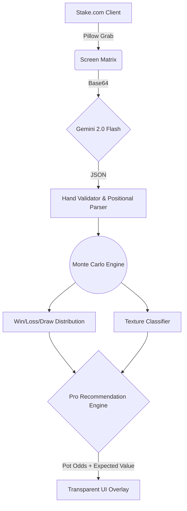

<div align="center">
  <h1>♠️ TEXAS HOLD'EM PRO ASSISTANT ♠️</h1>
  <p><i>Zero-click real-time poker equity analyzer powered by Gemini Vision & Monte Carlo simulation.</i></p>

  [](https://github.com/daksh/holdem-assistant)
  [](https://python.org)
  [](https://openrouter.ai)
  
  <br>
  <code>Fully autonomous screen parsing</code> • <code>Hardware-accelerated HUD</code> • <code>Pro-level Game Theory</code>
  <br><br>
</div>

---

## ⚡️ The Vibe
This isn't another clunky terminal script. This is an aesthetic, lightweight, transparent overlay HUD that sits exactly where you need it, parsing game states directly from pixels. 

It rips a screenshot of your Stake client, pipes it into `gemini-2.0-flash`, parses hole cards, community cards, pot odds, SPR, and bets, then rips thousands of Monte Carlo simulations to tell you exactly how to play the hand based on true positional Game Theory. Fully vibecoded. 

## 🚀 Quickstart

Drop into the matrix:

```bash
# 1. Install dependencies
pip install pillow

# 2. Drop your OpenRouter API key inside api.txt (no quotes)
echo "sk-or-v1-..." > api.txt

# 3. Fire up the HUD overlay
python assistant.py --overlay
```

## 🎮 Game Modes

### 🟢 Tactical HUD (The Main Event)
Creates a lightweight floating widget window. Click **SCAN** and the AI takes the wheel:
```bash
python assistant.py --overlay 
```
* **Auto-Mode**: Captures the screen, parses position, stack sizes, bets, and pot odds, running immediate Monte Carlo simulation.
* **Manual Fallback**: Automatically cascades to manual typing if you minimize your table. 

### 🟡 Diagnostic Test (Zero-Risk)
Just checks if the application can successfully parse your display output. 
```bash
python assistant.py --test
```

## 🧠 Brain Architecture



## 🎰 Advanced Pro Engine Features

* **Positional Awareness**: The AI recognizes the dealer button natively and recalculates thresholds dependent on if you're UTG or BTN.
* **Board Texture Classification**: Modifies the implied value threshold natively based on `Monotone`, `Wet`, `Dry` runout architectures. 
* **Dynamic SPR Advice**: (Stack to Pot Ratio) Adjusts recommendations to jam or pot control depending on commitment levels.
* **Opponent Scaling**: Drops your required flush-draw equity calling threshold when the pot multi-ways.

## 🃏 Rule Engine Config
Pure Texas Hold'em Math. Uses exact 5-card Hold'em evaluation rules.
```
Ranks: 2 3 4 5 6 7 8 9 T J Q K A
Suits: s (spades)  h (hearts)  d (diamonds)  c (clubs)

Example Hand: Ah Kd (Ace of Hearts, King of Diamonds)
```

<div align="center">
  <br>
  <i>Built fully on vibes. Don't play the cards, play the math.</i>
  <br><br>
</div>
